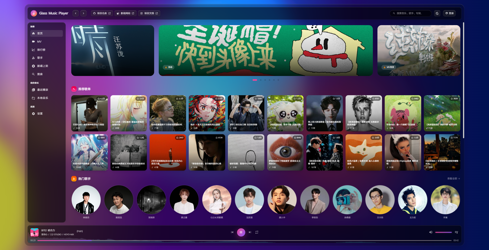
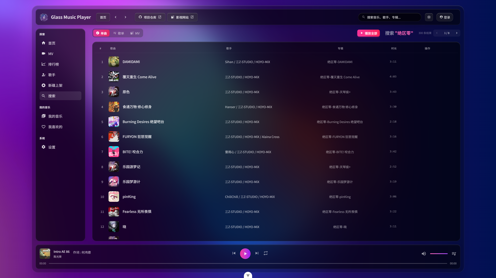
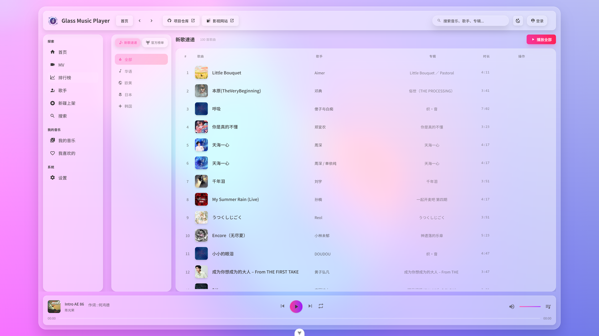
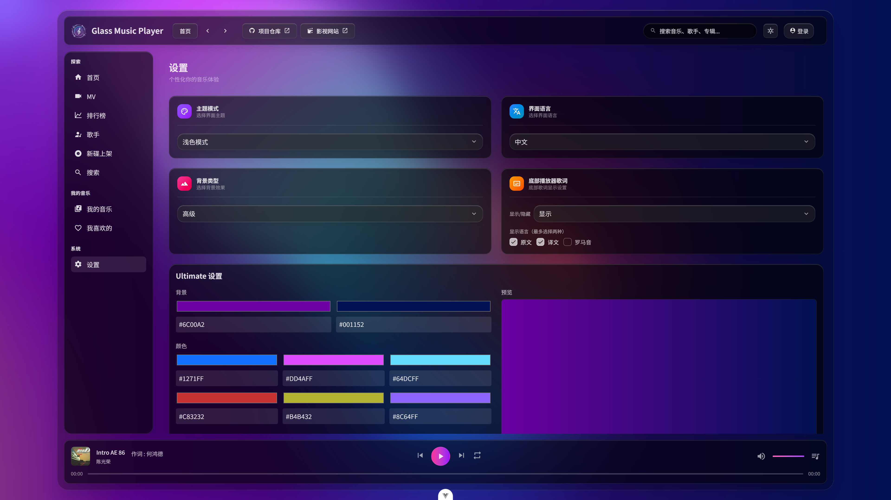

# Glass Music Player 🎵

<div align="center">

一款功能强大、界面精美的现代化音乐播放器，采用玻璃态设计风格。

[功能特性](#功能特性) • [快速开始](#快速开始) • [项目结构](#项目结构) • [技术栈](#技术栈) • [开发指南](#开发指南)

</div>

---

## ✨ 功能特性

- 🎨 **精美的玻璃态 UI** - 采用现代化的玻璃态设计风格，视觉效果出色
- 🎵 **完整的音乐播放功能** - 支持播放、暂停、上一曲、下一曲、随机播放等
- 📱 **全面的响应式设计** - 完美适配桌面端和移动端
- 🎬 **MV 播放功能** - 支持音乐视频播放
- 💾 **本地音乐支持** - 可播放本地音乐文件，自动解析音乐元数据
- ⭐ **个人收藏管理** - 收藏喜欢的歌曲、歌单、专辑
- 🔍 **智能搜索** - 快速搜索歌曲、歌手、专辑
- 🎤 **歌手详情页** - 查看歌手信息、作品列表
- 📊 **排行榜** - 浏览各类音乐榜单
- 🌐 **国际化** - 支持多语言切换
- 🎯 **状态持久化** - 使用 Pinia 进行状态管理，支持数据持久化
- 🎨 **动画效果** - 使用 GSAP、Lottie、Three.js 等打造流畅动画

---

## 📸 界面预览

<div align="center">

### 桌面端



### 更多截图

<details>
<summary>点击展开查看更多界面截图</summary>






</details>

</div>

---

## 🚀 快速开始

### 环境要求

- **Node.js**: >= 22
- **pnpm**: >= 10

### 安装依赖

```bash
pnpm install
```

### 开发模式

```bash
# 本地开发服务器（默认端口：5089）
pnpm dev
```

### 构建项目

```bash
# 生产环境构建
pnpm build

# 测试环境构建
pnpm build:test

# 预览生产环境构建
pnpm preview
```

### 其他脚本

```bash
# 代码检查和修复
pnpm lint

# 代码格式化
pnpm format

# 生成桌面端截图
pnpm screenshots

# 生成移动端截图
pnpm screenshots:mobile
```

---

## 📁 项目结构

```
GlassMusicPlayer/
├── src/
│   ├── api/              # API 接口定义
│   ├── assets/           # 静态资源文件
│   ├── components/       # Vue 公共组件
│   ├── composables/      # Vue 组合式函数
│   ├── config/           # 项目配置文件
│   ├── languages/        # 国际化语言文件
│   ├── layout/           # 布局组件
│   ├── pages/            # 页面组件
│   │   ├── index.vue         # 主页
│   │   ├── artist.vue        # 歌手详情
│   │   ├── playlist.vue      # 歌单详情
│   │   ├── search.vue        # 搜索页面
│   │   ├── settings.vue      # 设置页面
│   │   ├── local-music.vue   # 本地音乐
│   │   ├── mv-player.vue     # MV 播放器
│   │   └── mobile/           # 移动端页面
│   ├── routers/          # 路由配置
│   ├── stores/           # Pinia 状态管理
│   ├── style/            # 全局样式文件
│   ├── utils/            # 工具函数
│   ├── typings/          # TypeScript 类型定义
│   ├── App.vue           # 根组件
│   └── main.ts           # 应用入口
├── build/                # 构建配置文件
├── public/               # 公共静态资源
├── images/               # 项目截图
├── scripts/              # 脚本文件
├── .env.development      # 开发环境配置
├── .env.production       # 生产环境配置
├── .env.test             # 测试环境配置
├── index.html            # HTML 入口文件
├── vite.config.ts        # Vite 配置文件
├── tsconfig.json         # TypeScript 配置
├── package.json          # 项目依赖配置
└── README.md             # 项目说明文档
```

---

## 🛠 技术栈

### 核心框架

- **[Vue 3](https://vuejs.org/)** - 渐进式 JavaScript 框架
- **[TypeScript](https://www.typescriptlang.org/)** - JavaScript 的超集，提供类型安全
- **[Vite](https://vitejs.dev/)** - 下一代前端构建工具

### UI & 样式

- **[TailwindCSS](https://tailwindcss.com/)** - 实用工具优先的 CSS 框架
- **[GSAP](https://greensock.com/gsap/)** - 专业级动画库
- **[Lottie Web](https://airbnb.io/lottie/)** - 动画渲染库
- **[Three.js](https://threejs.org/)** - 3D 图形库
- **[OGL](https://oframe.github.io/ogl/)** - 轻量级 WebGL 库
- **[Swiper](https://swiperjs.com/)** - 现代化的移动端滑动组件

### 状态管理 & 路由

- **[Vue Router](https://router.vuejs.org/)** - Vue 官方路由管理器
- **[Pinia](https://pinia.vuejs.org/)** - Vue 官方状态管理库
- **[pinia-plugin-persistedstate](https://prazdevs.github.io/pinia-plugin-persistedstate/)** - Pinia 持久化插件

### 工具库

- **[Axios](https://axios-http.com/)** - HTTP 客户端
- **[VueUse](https://vueuse.org/)** - Vue 组合式工具集
- **[music-metadata-browser](https://github.com/Borewit/music-metadata-browser)** - 音乐元数据解析
- **[ArtPlayer](https://artplayer.org/)** - HTML5 视频播放器
- **[HLS.js](https://github.com/video-dev/hls.js/)** - HLS 流媒体播放
- **[nprogress](https://ricostacruz.com/nprogress/)** - 页面加载进度条

### 开发工具

- **[ESLint](https://eslint.org/)** - 代码检查工具
- **[Prettier](https://prettier.io/)** - 代码格式化工具
- **[unplugin-auto-import](https://github.com/unplugin/unplugin-auto-import)** - 自动导入 API
- **[unplugin-vue-components](https://github.com/unplugin/unplugin-vue-components)** - 自动导入组件
- **[unplugin-icons](https://github.com/unplugin/unplugin-icons)** - 图标自动导入
- **[vite-plugin-vue-devtools](https://devtools.vuejs.org/)** - Vue 开发者工具

---

## 💻 开发指南

### 环境变量配置

项目支持多环境配置，可以在对应的 `.env.*` 文件中配置：

- `.env.development` - 开发环境
- `.env.test` - 测试环境
- `.env.production` - 生产环境

### 代理配置

在 `vite.config.ts` 中配置了媒体代理，用于解决跨域问题。开发环境下可通过 `/media?url=<音频地址>` 访问音频资源。

### 代码规范

项目使用 ESLint 和 Prettier 进行代码规范管理：

```bash
# 运行 ESLint 检查
pnpm lint

# 运行 Prettier 格式化
pnpm format
```

### 自动导入

项目配置了自动导入功能：

- **API 自动导入**：Vue、Vue Router、Pinia 等常用 API 无需手动导入
- **组件自动导入**：`src/components` 目录下的组件可直接使用
- **图标自动导入**：支持 Iconify 图标库

---

## 📝 许可证

本项目采用 [PolyForm Noncommercial License 1.0.0](./LICENSE) 许可证。

**Copyright** © Yxcr ([https://github.com/XiangZi7](https://github.com/XiangZi7))

### 重要说明

- ✅ **允许**：个人学习、研究、测试使用
- ✅ **允许**：非商业组织、教育机构、慈善组织使用
- ❌ **禁止**：商业用途
- ❌ **禁止**：未经授权的分发和转让

详细许可内容请查阅 [LICENSE](./LICENSE) 文件。

---

---

## 🙏 鸣谢

感谢所有为本项目做出贡献的开发者和开源项目！

---

<div align="center">

**如果这个项目对你有帮助，请给一个 ⭐️ Star 支持一下！**

Made with ❤️ by Yxcr

</div>
